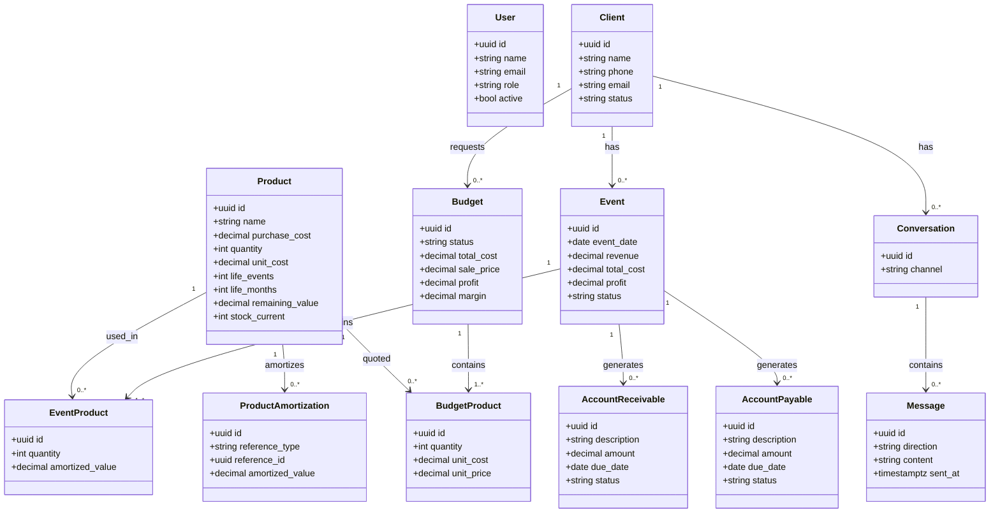
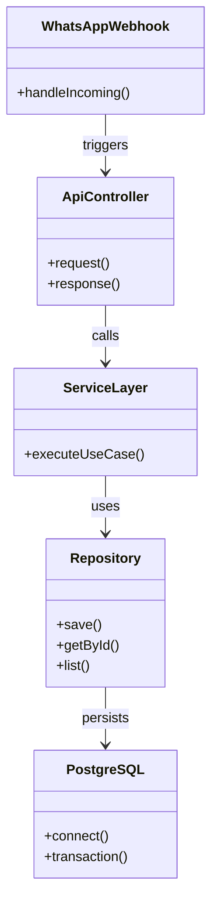

# Diagramas de Classe (Mermaid)

## Domínio Principal

```mermaid
classDiagram
  class User {
    +uuid id
    +string name
    +string email
    +string role
    +bool active
  }

  class Client {
    +uuid id
    +string name
    +string phone
    +string email
    +string status
  }

  class Product {
    +uuid id
    +string name
    +decimal purchase_cost
    +int quantity
    +decimal unit_cost
    +int life_events
    +int life_months
    +decimal remaining_value
    +int stock_current
  }

  class Event {
    +uuid id
    +date event_date
    +decimal revenue
    +decimal total_cost
    +decimal profit
    +string status
  }

  class EventProduct {
    +uuid id
    +int quantity
    +decimal amortized_value
  }

  class Budget {
    +uuid id
    +string status
    +decimal total_cost
    +decimal sale_price
    +decimal profit
    +decimal margin
  }

  class BudgetProduct {
    +uuid id
    +int quantity
    +decimal unit_cost
    +decimal unit_price
  }

  class AccountPayable {
    +uuid id
    +string description
    +decimal amount
    +date due_date
    +string status
  }

  class AccountReceivable {
    +uuid id
    +string description
    +decimal amount
    +date due_date
    +string status
  }

  class Conversation {
    +uuid id
    +string channel
  }

  class Message {
    +uuid id
    +string direction
    +string content
    +timestamptz sent_at
  }

  class ProductAmortization {
    +uuid id
    +string reference_type
    +uuid reference_id
    +decimal amortized_value
  }

  Client "1" --> "0..*" Event : has
  Event "1" --> "1..*" EventProduct : contains
  Product "1" --> "0..*" EventProduct : used_in

  Client "1" --> "0..*" Budget : requests
  Budget "1" --> "1..*" BudgetProduct : contains
  Product "1" --> "0..*" BudgetProduct : quoted

  Event "1" --> "0..*" AccountReceivable : generates
  Event "1" --> "0..*" AccountPayable : generates

  Client "1" --> "0..*" Conversation : has
  Conversation "1" --> "0..*" Message : contains

  Product "1" --> "0..*" ProductAmortization : amortizes
```

## Integração e Persistência

```mermaid
classDiagram
  class ApiController {
    +request()
    +response()
  }

  class ServiceLayer {
    +executeUseCase()
  }

  class Repository {
    +save()
    +getById()
    +list()
  }

  class WhatsAppWebhook {
    +handleIncoming()
  }

  class PostgreSQL {
    +connect()
    +transaction()
  }

  ApiController --> ServiceLayer : calls
  ServiceLayer --> Repository : uses
  Repository --> PostgreSQL : persists
  WhatsAppWebhook --> ApiController : triggers
```
