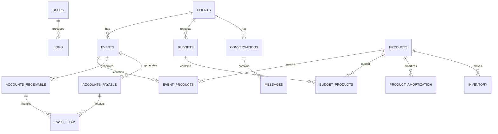

# Modelo ER (Mermaid)

```mermaid
erDiagram
  USERS ||--o{ LOGS : produces
  CLIENTS ||--o{ EVENTS : has
  CLIENTS ||--o{ BUDGETS : requests
  CLIENTS ||--o{ CONVERSATIONS : has
  CONVERSATIONS ||--o{ MESSAGES : contains

  PRODUCTS ||--o{ EVENT_PRODUCTS : used_in
  EVENTS ||--o{ EVENT_PRODUCTS : contains

  PRODUCTS ||--o{ BUDGET_PRODUCTS : quoted
  BUDGETS ||--o{ BUDGET_PRODUCTS : contains

  PRODUCTS ||--o{ PRODUCT_AMORTIZATION : amortizes
  PRODUCTS ||--o{ INVENTORY : moves

  EVENTS ||--o{ ACCOUNTS_RECEIVABLE : generates
  EVENTS ||--o{ ACCOUNTS_PAYABLE : generates

  ACCOUNTS_RECEIVABLE ||--o{ CASH_FLOW : impacts
  ACCOUNTS_PAYABLE ||--o{ CASH_FLOW : impacts
```
