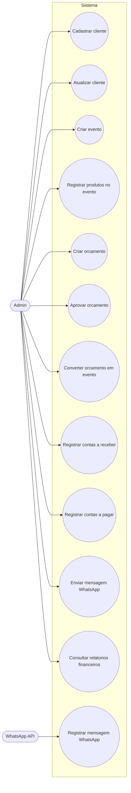

# Documento de Casos de Uso

## 1. Introducao
Este documento descreve os casos de uso principais do ERP + CRM + WhatsApp, alinhados a arquitetura definida e aos fluxos de negocio.

## 2. Atores do Sistema
- Admin: usuario com acesso total ao sistema.
- Atendente (futuro): operacao de CRM e WhatsApp.
- Financeiro (futuro): gestao de contas a pagar/receber e fluxo de caixa.
- WhatsApp API: fonte externa de mensagens.

## 3. Lista de Casos de Uso
1. Cadastrar cliente
2. Atualizar cliente
3. Criar evento
4. Registrar produtos no evento
5. Criar orcamento
6. Aprovar orcamento
7. Converter orcamento em evento
8. Registrar contas a receber
9. Registrar contas a pagar
10. Registrar mensagem WhatsApp
11. Enviar mensagem WhatsApp
12. Consultar relatorios financeiros

## 4. Descricao Detalhada dos Casos de Uso

### UC-01: Cadastrar cliente
- Ator principal: Admin
- Objetivo: cadastrar um novo cliente no CRM.
- Pre-condicoes: usuario autenticado.
- Pos-condicoes: cliente registrado e disponivel para eventos e orcamentos.

### UC-02: Atualizar cliente
- Ator principal: Admin
- Objetivo: atualizar dados cadastrais do cliente.
- Pre-condicoes: cliente existente.
- Pos-condicoes: dados atualizados e historico preservado.

### UC-03: Criar evento
- Ator principal: Admin
- Objetivo: registrar evento e custos associados.
- Pre-condicoes: cliente existente e produtos cadastrados.
- Pos-condicoes: evento salvo com amortizacao e custo total.

### UC-04: Registrar produtos no evento
- Ator principal: Admin
- Objetivo: associar produtos utilizados ao evento.
- Pre-condicoes: evento criado.
- Pos-condicoes: itens vinculados e amortizacao calculada.

### UC-05: Criar orcamento
- Ator principal: Admin
- Objetivo: gerar orcamento com custos e margens.
- Pre-condicoes: cliente existente e produtos cadastrados.
- Pos-condicoes: orcamento salvo com status inicial.

### UC-06: Aprovar orcamento
- Ator principal: Admin
- Objetivo: aprovar orcamento e preparar conversao em evento.
- Pre-condicoes: orcamento em status enviado.
- Pos-condicoes: orcamento aprovado.

### UC-07: Converter orcamento em evento
- Ator principal: Admin
- Objetivo: transformar orcamento aprovado em evento.
- Pre-condicoes: orcamento aprovado.
- Pos-condicoes: evento criado e contas a receber geradas.

### UC-08: Registrar contas a receber
- Ator principal: Admin
- Objetivo: registrar receita prevista de um evento.
- Pre-condicoes: evento criado.
- Pos-condicoes: conta a receber registrada.

### UC-09: Registrar contas a pagar
- Ator principal: Admin
- Objetivo: registrar despesa relacionada a compras ou eventos.
- Pre-condicoes: compra registrada.
- Pos-condicoes: conta a pagar registrada.

### UC-10: Registrar mensagem WhatsApp
- Ator principal: WhatsApp API
- Objetivo: registrar mensagem recebida no CRM.
- Pre-condicoes: webhook ativo.
- Pos-condicoes: mensagem gravada e vinculada ao cliente.

### UC-11: Enviar mensagem WhatsApp
- Ator principal: Admin
- Objetivo: enviar mensagem ou orcamento ao cliente.
- Pre-condicoes: cliente com numero valido.
- Pos-condicoes: mensagem enviada e registrada.

### UC-12: Consultar relatorios financeiros
- Ator principal: Admin
- Objetivo: visualizar fluxo de caixa e lucro por evento.
- Pre-condicoes: dados financeiros existentes.
- Pos-condicoes: relatorio exibido.

## 5. Fluxos Principais (resumo)
- Cadastro de cliente: Streamlit -> API -> PostgreSQL (Supabase).
- Criacao de evento: Streamlit -> API -> calculo amortizacao -> PostgreSQL.
- Orcamento aprovado: Streamlit -> API -> conversao em evento -> contas a receber.
- Mensagem WhatsApp: Webhook -> API -> PostgreSQL -> Streamlit.

## 6. Fluxos Alternativos
- Cliente duplicado: API rejeita e solicita revisao.
- Orcamento recusado: status atualizado sem conversao.
- Falha WhatsApp: mensagem registrada com status pendente.

## 7. Regras de Negocio Relacionadas
- Amortizacao por evento ou por tempo.
- Orcamento aprovado gera evento.
- Contas a pagar/receber impactam fluxo de caixa.
- Streamlit nao acessa banco diretamente.

## 8. Diagrama de Casos de Uso (UML)

